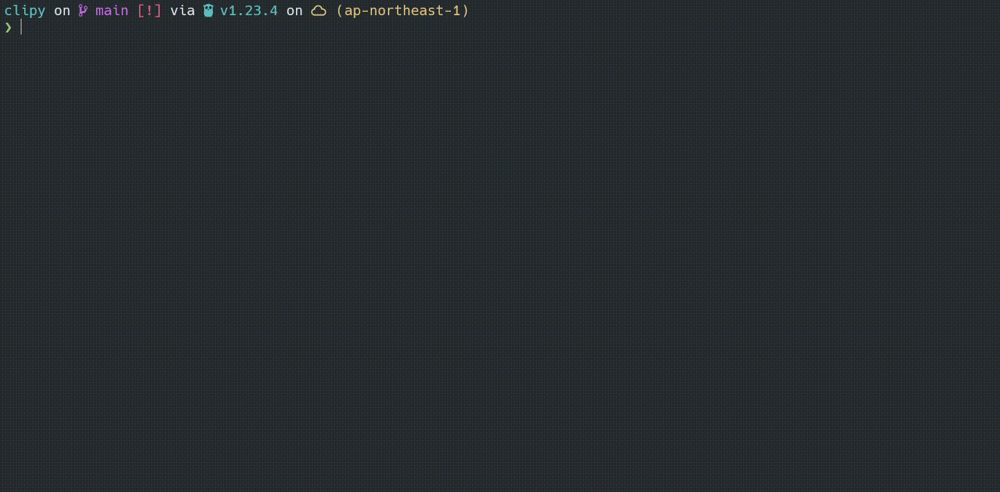

# 📋clipy: Manage Your Clipboard History

clipy is a simple tool that saves your clipboard history to a local sqlite database and lets you browse and select entries using an fzf-like interface.



## How to install

To install clipy using Go, run:

```sh
$ go install github.com/szktkfm/clipy/cmd/clipy@latest
```

Or, download it:

[GitHub Releases](https://github.com/szktkfm/clipy/releases)

## How to use

Run `clipy shell` to generate a shell script, and then add it to your zshrc or bashrc file for seamless integration.

```sh
$ clipy shell zsh | tee -a ~/.zshrc

# https://github.com/szktkfm/clipy
# Run daemon
clipy

__clipy_history() {
    BUFFER="${BUFFER}"$(clipy history --tmux)
    CURSOR=${#BUFFER}
    zle redisplay
}
zle -N __clipy_history

# Bind the function to Ctrl+j
bindkey "^j" __clipy_history
```

```sh
$ source ~/.zshrc
```

Use the `clipy` command to start a background daemon. This daemon monitors your clipboard for new entries and saves them to the local sqlite database.

```sh
$ clipy
```

Access your clipboard history with the `clipy history` command. If you've set up the shell integration, you can invoke this with Ctrl + J for quick access.

```sh
$ clipy history 
```


Use the `--limit` option to specify the maximum number of entries to display initially.

```sh
$ clipy history --limit 100
```

If you're using tmux, you can display the history in a popup using `tmux display-popup`.

That's it! 🚀

## Future Work or Idea

Sync Across Machines: Integrate with Litestream to sync clipboard history between machines seamlessly.

Clipboard Server: Run clipy as a centralized clipboard server to share and manage history across multiple devices.

## License

[MIT](LICENSE)
